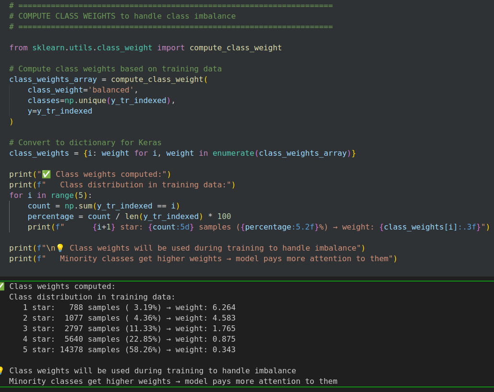

# Assignment4
https://www.kaggle.com/competitions/assignment-4-rnn-text-classification-fall2025/

### Huggingface Model used for embeddings generation
https://huggingface.co/BAAI/bge-m3

### Download Chunkked Embeddings vector files from Google Drive
https://drive.google.com/drive/folders/1WVV5YAsO_X3avq7b8fQv2SZp5ilejKO1?usp=drive_link

## Class Weights

## Best HyperParameters found

## Model Summary

## Training plot

